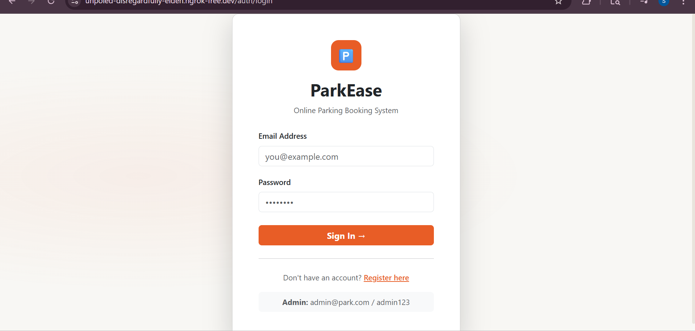
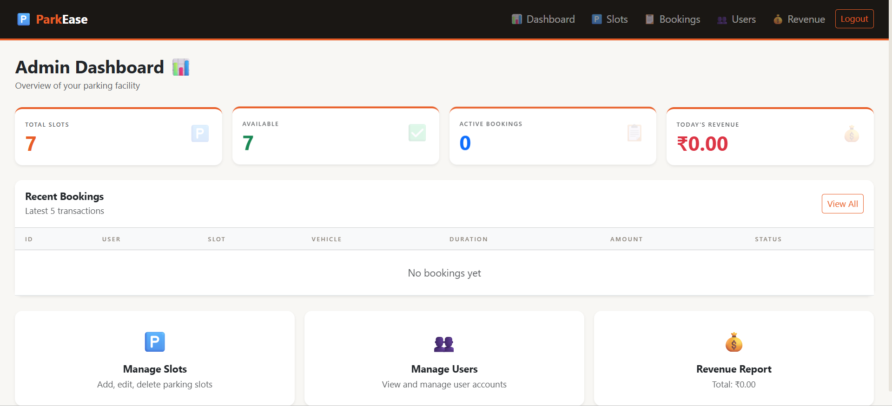
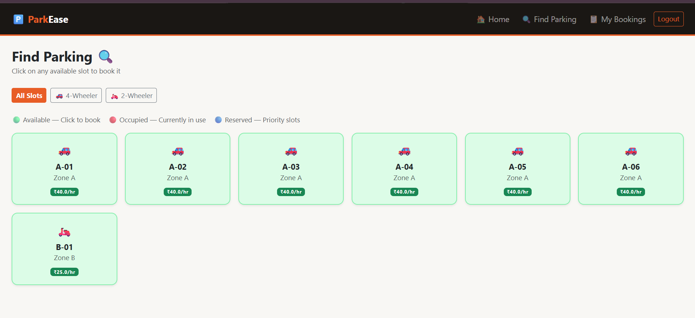
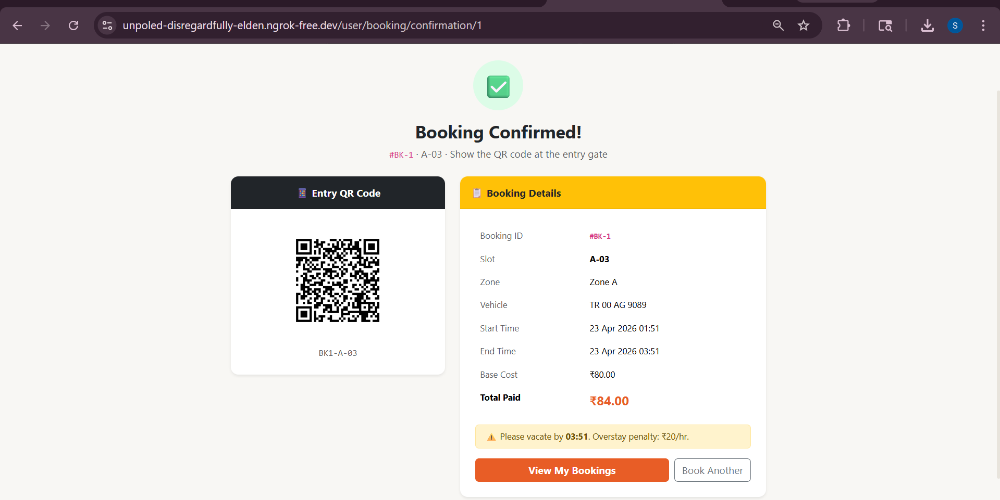

#  ParkEase — Online Parking Booking System

This is a full-stack parking management system I built using Spring Boot to understand how real-world booking systems work (like slot allocation, preventing conflicts, etc.).

The goal of this project was to go beyond CRUD and actually implement **real business logic** like booking validation, auto slot release, and role-based access.

---

## 🚀 Tech Stack

* **Backend:** Java 21, Spring Boot
* **Database:** MySQL
* **Frontend:** Thymeleaf, Bootstrap
* **Security:** Spring Security + BCrypt
* **Build Tool:** Maven

---

## 📸 Screenshots

> (Add these after you run your project)

### 🔐 Login Page



### 🧑‍💼 Admin Dashboard



### 🚗 User Slot View



### 📅 Booking Confirmation + QR



---

## ✨ Features

### 👤 User Side

* Register & login
* View available parking slots
* Filter by vehicle type (2W / 4W)
* Book a slot with time + duration
* Live price calculation before booking
* QR code generated after booking
* Cancel bookings
* View booking history

---

### 🧑‍💼 Admin Side

* Admin login
* Add / edit / delete parking slots
* Mark slots as reserved/unreserved
* Set pricing per slot
* View all bookings
* Manage users (enable/disable)
* View revenue stats

---

### ⚙️ Core Logic Implemented

* Prevents **double booking** using time overlap checks
* Slots automatically marked as occupied during booking
* Scheduler releases slots after booking ends
* Overstay penalty calculation
* Role-based access (ADMIN / USER)

---

## 🛠️ How to Run Locally

### 1. Clone the repo

```bash
git clone https://github.com/YOUR_USERNAME/parking-system.git
cd parking-system
```

### 2. Create database

```sql
CREATE DATABASE parking_db;
```

### 3. Configure DB credentials

Edit:

```
src/main/resources/application.properties
```

---

### 4. Run the app

```bash
mvn spring-boot:run
```

---

### 5. Open in browser

```
http://localhost:8080
```

---

### Default Admin Login

```
admin@park.com
admin123
```

---

## 📁 Project Structure (simplified)

```
controller → handles requests
service → business logic
repository → database interaction
model → entities
```

---

## 💡 What I Learned

* How Spring Boot actually connects everything (Controller → Service → DB)
* Handling real-world problems like booking conflicts
* Using schedulers for background tasks
* Implementing authentication and role-based access
* Structuring a full-stack project properly

---

## ⚠️ Future Improvements

* Payment integration
* Email notifications
* Better UI (React maybe)
* Deployment with Docker

---

## 📌 Note

This project is mainly built for learning purposes and to understand how backend systems work in real scenarios.

---

## 📄 License

MIT
